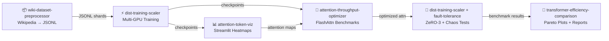

<div align="center">

# 🤖 Transformer Research Hub

**Central showcase and navigation for Transformer research experiments**

*Attention mechanisms · Scaling · Datasets · Visualization · Fault Tolerance*

[](https://github.com/TylrDn)
[](https://github.com/TylrDn)

> Taylor Dean — IBM Systems Engineer | ML Researcher | Distributed Training & Transformer Architecture

</div>

---

## 🗂️ Project Ecosystem

Six interconnected projects covering the full lifecycle of Transformer research — from data ingestion through training, optimization, visualization, and fault tolerance.

| Project | Description | Language | Stars | Forks | Updated | Links |
|---------|-------------|----------|-------|-------|---------|-------|
| [**ai-attention-throughput-optimizer**](https://github.com/TylrDn/ai-attention-throughput-optimizer) | Profile, benchmark, and optimize throughput of new attention mechanisms |  | [](https://github.com/TylrDn/ai-attention-throughput-optimizer/stargazers) | [](https://github.com/TylrDn/ai-attention-throughput-optimizer/network/members) | [](https://github.com/TylrDn/ai-attention-throughput-optimizer/commits) | [⭐ Star](https://github.com/TylrDn/ai-attention-throughput-optimizer) · [🍴 Fork](https://github.com/TylrDn/ai-attention-throughput-optimizer/fork) |
| [**ai-transformer-efficiency-comparison**](https://github.com/TylrDn/ai-transformer-efficiency-comparison) | Compare compute efficiency of Transformer variants (FLOPs, latency, memory) |  | [](https://github.com/TylrDn/ai-transformer-efficiency-comparison/stargazers) | [](https://github.com/TylrDn/ai-transformer-efficiency-comparison/network/members) | [](https://github.com/TylrDn/ai-transformer-efficiency-comparison/commits) | [⭐ Star](https://github.com/TylrDn/ai-transformer-efficiency-comparison) · [🍴 Fork](https://github.com/TylrDn/ai-transformer-efficiency-comparison/fork) |
| [**ai-wiki-dataset-preprocessor**](https://github.com/TylrDn/ai-wiki-dataset-preprocessor) | Pipeline to process Wikipedia dumps into model-ready JSONL/text format |  | [](https://github.com/TylrDn/ai-wiki-dataset-preprocessor/stargazers) | [](https://github.com/TylrDn/ai-wiki-dataset-preprocessor/network/members) | [](https://github.com/TylrDn/ai-wiki-dataset-preprocessor/commits) | [⭐ Star](https://github.com/TylrDn/ai-wiki-dataset-preprocessor) · [🍴 Fork](https://github.com/TylrDn/ai-wiki-dataset-preprocessor/fork) |
| [**ai-dist-training-scaler**](https://github.com/TylrDn/ai-dist-training-scaler) | Scale Transformer training jobs to thousands of GPUs with Accelerate/DeepSpeed |  | [](https://github.com/TylrDn/ai-dist-training-scaler/stargazers) | [](https://github.com/TylrDn/ai-dist-training-scaler/network/members) | [](https://github.com/TylrDn/ai-dist-training-scaler/commits) | [⭐ Star](https://github.com/TylrDn/ai-dist-training-scaler) · [🍴 Fork](https://github.com/TylrDn/ai-dist-training-scaler/fork) |
| [**ai-fault-tolerance-design**](https://github.com/TylrDn/ai-fault-tolerance-design) | Design document and simulator for fault tolerance in distributed training systems |  | [](https://github.com/TylrDn/ai-fault-tolerance-design/stargazers) | [](https://github.com/TylrDn/ai-fault-tolerance-design/network/members) | [](https://github.com/TylrDn/ai-fault-tolerance-design/commits) | [⭐ Star](https://github.com/TylrDn/ai-fault-tolerance-design) · [🍴 Fork](https://github.com/TylrDn/ai-fault-tolerance-design/fork) |
| [**ai-attention-token-viz**](https://github.com/TylrDn/ai-attention-token-viz) | Interactive visualization tool for token-to-token attention in language models |  | [](https://github.com/TylrDn/ai-attention-token-viz/stargazers) | [](https://github.com/TylrDn/ai-attention-token-viz/network/members) | [](https://github.com/TylrDn/ai-attention-token-viz/commits) | [⭐ Star](https://github.com/TylrDn/ai-attention-token-viz) · [🍴 Fork](https://github.com/TylrDn/ai-attention-token-viz/fork) |

---

## 🏗️ Architecture Overview

```
┌─────────────────────────────────────────────────────────────────┐
│                     Transformer Research Hub                     │
└──────────────────────────┬──────────────────────────────────────┘
                           │
        ┌──────────────────┼──────────────────┐
        ▼                  ▼                  ▼
  ┌──────────┐      ┌────────────┐     ┌──────────────┐
  │ Dataset  │      │ Training   │     │ Visualization│
  │ Pipeline │      │ & Scaling  │     │ & Analysis   │
  └────┬─────┘      └─────┬──────┘     └──────┬───────┘
       │                  │                   │
       ▼                  ▼                   ▼
  ai-wiki-dataset    ai-dist-training    ai-attention-
  -preprocessor        -scaler           token-viz
                           │
              ┌────────────┼────────────┐
              ▼            ▼            ▼
        ai-attention  ai-transformer  ai-fault-
        -throughput-   -efficiency-  tolerance-
         optimizer     comparison     design
```

See [docs/architecture.md](docs/architecture.md) for the full Mermaid diagram.

### Research Pipeline



See [docs/roadmap.md](docs/roadmap.md) for the full Kanban board.
See [REFERENCES.md](REFERENCES.md) for the centralised arXiv citation registry.

---

## 🔬 Sister Repository Details

<details>
<summary><strong>📦 ai-wiki-dataset-preprocessor</strong> — Data Layer</summary>

**Purpose:** Process raw Wikipedia XML dumps into clean, model-ready JSONL shards.

**Key features:**
- BZ2 dump extraction via WikiExtractor
- MinHash deduplication (LSH threshold configurable)
- Configurable shard size and token-count filtering
- HuggingFace Datasets export and Hub push

**Outputs:** `*.jsonl` shards · vocabulary files · dataset statistics

**Quick start:**

```bash
python preprocess.py --input dump.xml.bz2 --output data/
```

✅ **Notebook:** [`notebooks/01_wiki_preprocessing.ipynb`](notebooks/01_wiki_preprocessing.ipynb) — full dump → JSONL pipeline, MinHash dedup, HuggingFace export

</details>

<details>
<summary><strong>⚡ ai-dist-training-scaler</strong> — Training Layer</summary>

**Purpose:** Orchestrate multi-GPU/multi-node distributed Transformer training.

**Key features:**
- HuggingFace Accelerate + DeepSpeed ZeRO stages 1–3
- Shared ZeRO-3 config: `configs/deepspeed_zero3.json`
- Mixed precision (bf16/fp16), gradient checkpointing
- Consumes wiki JSONL from `ai-wiki-dataset-preprocessor`

**Outputs:** model checkpoints · training logs · TensorBoard/wandb metrics

**Quick start:**

```bash
accelerate launch train.py --config config.yaml
```

✅ **Notebook:** [`notebooks/05_deepspeed_zero3_training.ipynb`](notebooks/05_deepspeed_zero3_training.ipynb) — ZeRO-3 training loop, fault injection, checkpoint recovery

</details>

<details>
<summary><strong>🛡️ ai-fault-tolerance-design</strong> — Training Layer</summary>

**Purpose:** Fault tolerance infrastructure and Monte Carlo failure simulator.

**Key features:**
- Periodic checkpointing with automatic resume
- Monte Carlo job survival probability estimator
- Chaos engineering scenarios: node failure, gradient corruption, slow nodes

**Integrates with:** `ai-dist-training-scaler` as a resilience wrapper

✅ **Notebook:** [`notebooks/06_chaos_fault_injection.ipynb`](notebooks/06_chaos_fault_injection.ipynb) — DistributedTrainingSimulator, Monte Carlo reliability curve

</details>

<details>
<summary><strong>🔬 ai-attention-throughput-optimizer</strong> — Analysis Layer</summary>

**Purpose:** Profile and benchmark attention mechanism implementations.

**Key features:**
- Vanilla softmax, FlashAttention-2/3, linear, sparse attention
- Throughput (tokens/sec), memory footprint, latency across sequence lengths
- CSV outputs for downstream programmatic consumption

**Outputs:** benchmark CSVs · profiling reports · optimized attention modules

**Quick start:**

```bash
python benchmark.py --model flash-attention
```

✅ **Notebook:** [`notebooks/02_flashattn3_benchmark.ipynb`](notebooks/02_flashattn3_benchmark.ipynb) — FlashAttention-2/3 benchmark, 1k–64k seq lengths, Plotly heatmaps

</details>

<details>
<summary><strong>📊 ai-transformer-efficiency-comparison</strong> — Analysis Layer</summary>

**Purpose:** Systematically compare Transformer variants by compute efficiency.

**Key features:**
- FLOPs, wall-clock latency, peak GPU memory comparison
- GPT-2 vs RWKV Pareto efficiency plots
- Publication-ready Markdown reports and matplotlib/plotly figures

**Outputs:** comparison tables · Pareto plots · Markdown reports

**Quick start:**

```bash
python compare.py --variants vanilla,linear,flash
```

✅ **Notebook:** [`notebooks/03_gpt2_rwkv_pareto.ipynb`](notebooks/03_gpt2_rwkv_pareto.ipynb) — GPT-2 vs RWKV perplexity × latency Pareto analysis
**TODO (Phase 5):** SOTA comparison vs LLaMA-3-8B, Mistral-7B

</details>

<details>
<summary><strong>🖼️ ai-attention-token-viz</strong> — Visualization Layer</summary>

**Purpose:** Interactive web UI for token-to-token attention heatmaps.

**Key features:**
- Streamlit + Plotly interactive attention maps
- Any HuggingFace-compatible language model supported
- Head-level and layer-level navigation
- Exports interactive HTML and PNG snapshots

**Quick start:**

```bash
python viz.py --model bert-base-uncased --text "Hello world"
```

✅ **Notebook:** [`notebooks/04_attention_viz_streamlit.ipynb`](notebooks/04_attention_viz_streamlit.ipynb) — BERT attention extractor + Streamlit heatmap app generator
**TODO (Phase 5):** Deploy to HuggingFace Spaces

</details>

---

## ⬇️ Clone All Repos

Clone the entire ecosystem in one command:

```bash
bash <(curl -fsSL https://raw.githubusercontent.com/TylrDn/ai-transformer-research-hub/main/scripts/clone-all.sh)
```

Or clone the hub first, then run the script locally:

```bash
git clone https://github.com/TylrDn/ai-transformer-research-hub
bash ai-transformer-research-hub/scripts/clone-all.sh ./research
```

---

## 🚀 Quick Start

Each project is self-contained. To get started with any of them:

```bash
# 1. Clone the project you want
git clone https://github.com/TylrDn/<project-name>
cd <project-name>

# 2. Install dependencies
pip install -r requirements.txt

# 3. Run the main script or check the README for specific instructions
python main.py
```

### Project-Specific Quickstarts

| Project | One-line Run |
|---------|-------------|
| [ai-attention-throughput-optimizer](https://github.com/TylrDn/ai-attention-throughput-optimizer) | `python benchmark.py --model flash-attention` |
| [ai-transformer-efficiency-comparison](https://github.com/TylrDn/ai-transformer-efficiency-comparison) | `python compare.py --variants vanilla,linear,flash` |
| [ai-wiki-dataset-preprocessor](https://github.com/TylrDn/ai-wiki-dataset-preprocessor) | `python preprocess.py --input dump.xml.bz2 --output data/` |
| [ai-dist-training-scaler](https://github.com/TylrDn/ai-dist-training-scaler) | `accelerate launch train.py --config config.yaml` |
| [ai-fault-tolerance-design](https://github.com/TylrDn/ai-fault-tolerance-design) | `python simulate.py --nodes 64 --failure-rate 0.01` |
| [ai-attention-token-viz](https://github.com/TylrDn/ai-attention-token-viz) | `python viz.py --model bert-base-uncased --text "Hello world"` |

---

## 🗺️ Roadmap

See [docs/roadmap.md](docs/roadmap.md) for the full Kanban board with all phases and milestones.

### ✅ Phase 1A — Hub Enhancements (Complete)

- [x] Dynamic shields.io badges (stars, forks, last-updated) for all 6 repos
- [x] "Clone All" bash script (`scripts/clone-all.sh`)
- [x] Mermaid pipeline diagram: wiki data → models → viz → optimize → scale → docs
- [x] Weekly cron job to refresh badges/stats (`.github/workflows/weekly-stats.yml`)
- [x] GitHub Pages deploy from README (`.github/workflows/pages.yml`)
- [x] Kanban roadmap document (`docs/roadmap.md`)
- [x] Copilot instructions (`.github/copilot-instructions.md`)

### ✅ Phase 1B — Foundation (Complete)

- [x] Core dataset preprocessing pipeline (`ai-wiki-dataset-preprocessor`)
- [x] Attention mechanism benchmarking framework (`ai-attention-throughput-optimizer`)
- [x] Transformer efficiency comparison suite (`ai-transformer-efficiency-comparison`)
- [x] Distributed training infrastructure (`ai-dist-training-scaler`)
- [x] Fault tolerance design & simulation (`ai-fault-tolerance-design`)
- [x] Attention visualization tooling (`ai-attention-token-viz`)

### 🚧 Phase 2 — Repo Hardening (Instructions Complete)

- [x] Per-repo Copilot instructions in `docs/instructions/<repo>/copilot-instructions.md` (all 6 sister repos)
- [ ] pytest suites + CI workflows per repo (template: `templates/repo-ci.yml`)
- [ ] Cross-link datasets/models (wiki JSONL → trainers)

### ✅ Phase 3 — Notebook Pipelines (Complete)

- [x] Hub-level notebooks in `notebooks/` (all 6 fully implemented)
- [x] Wiki: full dump → JSONL pipeline, MinHash dedup, HuggingFace Dataset export
- [x] Attn: FlashAttention-2/3 benchmark 1k–64k seq, Plotly heatmaps
- [x] Compare: GPT-2 vs RWKV on wiki data, Pareto plots
- [x] Viz: BERT attention extractor + Streamlit heatmap app generator
- [x] Scale: DeepSpeed ZeRO-3 training loop + fault injection + checkpoint recovery
- [x] Fault: DistributedTrainingSimulator + Monte Carlo reliability curve

### 🔮 Phase 4 — Integration (Framework Ready)

- [x] Multi-root VS Code workspace (`transformer-research-hub.code-workspace`)
- [x] End-to-end pipeline script (`scripts/run-e2e-pipeline.sh`)
- [x] Cross-repo artefact sync (`scripts/sync_repos.sh`)
- [x] YouTube demo templates (`templates/youtube-demo-outline.md`)
- [x] Streamlit Cloud configs (`.streamlit/config.toml`)
- [x] Docker + Compose deployment (`Dockerfile`, `docker-compose.yml`)

### 🔮 Phase 5 — AI Industry Benchmarking (Planned)

- [ ] SOTA comparison: trained models vs LLaMA-3-8B, Mistral-7B, GPT-2-XL
- [ ] PapersWithCode leaderboard integration
- [ ] HuggingFace Spaces deployment for attention viz
- [ ] Kubernetes manifests for multi-GPU training jobs
- [ ] Long-context benchmark at 32k–128k tokens

---

## 🛠️ Developer Setup

### 1. Open the Multi-Root Workspace

Clone the hub, then open `transformer-research-hub.code-workspace` in VS Code to get
all seven repos, shared interpreter, and tasks in one window:

```bash
git clone https://github.com/TylrDn/ai-transformer-research-hub
code ai-transformer-research-hub/transformer-research-hub.code-workspace
```

### 2. Clone All Sister Repos

```bash
bash ai-transformer-research-hub/scripts/clone-all.sh ./research
```

### 3. Run the End-to-End Pipeline

```bash
# Dry-run to preview steps
bash scripts/run-e2e-pipeline.sh --dry-run

# Full run (single GPU)
bash scripts/run-e2e-pipeline.sh

# Distributed (4 GPUs)
bash scripts/run-e2e-pipeline.sh --distributed --num-processes 4

# Skip expensive steps during iteration
bash scripts/run-e2e-pipeline.sh --skip-preprocess --skip-train
```

### 4. Sync Artefacts from Sister Repos

```bash
# Sync everything (datasets, checkpoints, results)
bash scripts/sync_repos.sh

# Sync only datasets
bash scripts/sync_repos.sh --data-only

# Preview what would be copied
bash scripts/sync_repos.sh --dry-run
```

### 5. Run the Streamlit Demo

```bash
# Local (requires streamlit)
pip install streamlit plotly transformers
streamlit run notebooks/04_attention_viz_streamlit.ipynb

# Docker
docker compose up streamlit
```

### 6. Notebook Pipelines

Open any notebook in `notebooks/` to explore individual pipeline stages:

| Notebook | Topic | GPU? |
|----------|-------|------|
| `01_wiki_preprocessing.ipynb` | Wikipedia → JSONL | CPU ✓ |
| `02_flashattn3_benchmark.ipynb` | FlashAttention-3 benchmark | GPU recommended |
| `03_gpt2_rwkv_pareto.ipynb` | GPT-2 vs RWKV Pareto | CPU (slow) |
| `04_attention_viz_streamlit.ipynb` | Attention heatmaps | CPU ✓ |
| `05_deepspeed_zero3_training.ipynb` | ZeRO-3 distributed training | GPU recommended |
| `06_chaos_fault_injection.ipynb` | Fault injection simulation | CPU ✓ |

---

## 📊 GitHub Stats

<div align="center">


</div>

---

## 🤝 Contributing

Contributions are welcome across all projects in this hub! Please follow the guidelines below.

### How to Contribute

1. **Fork** the specific project repository you want to contribute to
2. **Create** a feature branch: `git checkout -b feature/your-feature-name`
3. **Commit** your changes: `git commit -m 'feat: add some feature'`
4. **Push** to your fork: `git push origin feature/your-feature-name`
5. **Open** a Pull Request against the `main` branch

### Commit Convention

This project uses [Conventional Commits](https://www.conventionalcommits.org/):

```
feat: new feature
fix: bug fix
docs: documentation change
perf: performance improvement
refactor: code refactor
test: adding/updating tests
chore: maintenance
```

### Code Standards

- Python: follow [PEP 8](https://pep8.org/) and include docstrings
- Tests: add unit tests for new functionality (pytest)
- Documentation: update README and inline comments as needed

---

## 📬 Contact & Links

<div align="center">

| Platform | Link |
|----------|------|
| 🐙 GitHub | [@TylrDn](https://github.com/TylrDn) |
| 💼 LinkedIn | [Taylor Dean](https://www.linkedin.com/in/t-dean/) |
| 🏢 IBM | IBM Systems Engineer |

</div>

---

## 📄 License

This project is licensed under the MIT License — see the [LICENSE](LICENSE) file for details.

---

<div align="center">

*Built with ❤️ for the ML research community*

[](https://github.com/TylrDn/ai-transformer-research-hub/stargazers)

</div>
