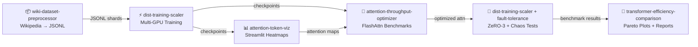

<div align="center">

# 🤖 Transformer Research Hub

**Central showcase and navigation for Transformer research experiments**

*Attention mechanisms · Scaling · Datasets · Visualization · Fault Tolerance*

[](https://github.com/TylrDn)
[](https://github.com/TylrDn)

> Taylor Dean — IBM Systems Engineer | ML Researcher | Distributed Training & Transformer Architecture

</div>

---

## 🗂️ Project Ecosystem

Six interconnected projects covering the full lifecycle of Transformer research — from data ingestion through training, optimization, visualization, and fault tolerance.

| Project | Description | Language | Stars | Forks | Updated | Links |
|---------|-------------|----------|-------|-------|---------|-------|
| [**ai-attention-throughput-optimizer**](https://github.com/TylrDn/ai-attention-throughput-optimizer) | Profile, benchmark, and optimize throughput of new attention mechanisms |  | [](https://github.com/TylrDn/ai-attention-throughput-optimizer/stargazers) | [](https://github.com/TylrDn/ai-attention-throughput-optimizer/network/members) | [](https://github.com/TylrDn/ai-attention-throughput-optimizer/commits) | [⭐ Star](https://github.com/TylrDn/ai-attention-throughput-optimizer) · [🍴 Fork](https://github.com/TylrDn/ai-attention-throughput-optimizer/fork) |
| [**ai-transformer-efficiency-comparison**](https://github.com/TylrDn/ai-transformer-efficiency-comparison) | Compare compute efficiency of Transformer variants (FLOPs, latency, memory) |  | [](https://github.com/TylrDn/ai-transformer-efficiency-comparison/stargazers) | [](https://github.com/TylrDn/ai-transformer-efficiency-comparison/network/members) | [](https://github.com/TylrDn/ai-transformer-efficiency-comparison/commits) | [⭐ Star](https://github.com/TylrDn/ai-transformer-efficiency-comparison) · [🍴 Fork](https://github.com/TylrDn/ai-transformer-efficiency-comparison/fork) |
| [**ai-wiki-dataset-preprocessor**](https://github.com/TylrDn/ai-wiki-dataset-preprocessor) | Pipeline to process Wikipedia dumps into model-ready JSONL/text format |  | [](https://github.com/TylrDn/ai-wiki-dataset-preprocessor/stargazers) | [](https://github.com/TylrDn/ai-wiki-dataset-preprocessor/network/members) | [](https://github.com/TylrDn/ai-wiki-dataset-preprocessor/commits) | [⭐ Star](https://github.com/TylrDn/ai-wiki-dataset-preprocessor) · [🍴 Fork](https://github.com/TylrDn/ai-wiki-dataset-preprocessor/fork) |
| [**ai-dist-training-scaler**](https://github.com/TylrDn/ai-dist-training-scaler) | Scale Transformer training jobs to thousands of GPUs with Accelerate/DeepSpeed |  | [](https://github.com/TylrDn/ai-dist-training-scaler/stargazers) | [](https://github.com/TylrDn/ai-dist-training-scaler/network/members) | [](https://github.com/TylrDn/ai-dist-training-scaler/commits) | [⭐ Star](https://github.com/TylrDn/ai-dist-training-scaler) · [🍴 Fork](https://github.com/TylrDn/ai-dist-training-scaler/fork) |
| [**ai-fault-tolerance-design**](https://github.com/TylrDn/ai-fault-tolerance-design) | Design document and simulator for fault tolerance in distributed training systems |  | [](https://github.com/TylrDn/ai-fault-tolerance-design/stargazers) | [](https://github.com/TylrDn/ai-fault-tolerance-design/network/members) | [](https://github.com/TylrDn/ai-fault-tolerance-design/commits) | [⭐ Star](https://github.com/TylrDn/ai-fault-tolerance-design) · [🍴 Fork](https://github.com/TylrDn/ai-fault-tolerance-design/fork) |
| [**ai-attention-token-viz**](https://github.com/TylrDn/ai-attention-token-viz) | Interactive visualization tool for token-to-token attention in language models |  | [](https://github.com/TylrDn/ai-attention-token-viz/stargazers) | [](https://github.com/TylrDn/ai-attention-token-viz/network/members) | [](https://github.com/TylrDn/ai-attention-token-viz/commits) | [⭐ Star](https://github.com/TylrDn/ai-attention-token-viz) · [🍴 Fork](https://github.com/TylrDn/ai-attention-token-viz/fork) |

---

## 🏗️ Architecture Overview

```
┌─────────────────────────────────────────────────────────────────┐
│                     Transformer Research Hub                     │
└──────────────────────────┬──────────────────────────────────────┘
                           │
        ┌──────────────────┼──────────────────┐
        ▼                  ▼                  ▼
  ┌──────────┐      ┌────────────┐     ┌──────────────┐
  │ Dataset  │      │ Training   │     │ Visualization│
  │ Pipeline │      │ & Scaling  │     │ & Analysis   │
  └────┬─────┘      └─────┬──────┘     └──────┬───────┘
       │                  │                   │
       ▼                  ▼                   ▼
  ai-wiki-dataset    ai-dist-training    ai-attention-
  -preprocessor        -scaler           token-viz
                           │
              ┌────────────┼────────────┐
              ▼            ▼            ▼
        ai-attention  ai-transformer  ai-fault-
        -throughput-   -efficiency-  tolerance-
         optimizer     comparison     design
```

See [docs/architecture.md](docs/architecture.md) for the full Mermaid diagram.

### Research Pipeline



See [docs/roadmap.md](docs/roadmap.md) for the full Kanban board.

---

## ⬇️ Clone All Repos

Clone the entire ecosystem in one command:

```bash
bash <(curl -fsSL https://raw.githubusercontent.com/TylrDn/ai-transformer-research-hub/main/scripts/clone-all.sh)
```

Or clone the hub first, then run the script locally:

```bash
git clone https://github.com/TylrDn/ai-transformer-research-hub
bash ai-transformer-research-hub/scripts/clone-all.sh ./research
```

---

## 🚀 Quick Start

Each project is self-contained. To get started with any of them:

```bash
# 1. Clone the project you want
git clone https://github.com/TylrDn/<project-name>
cd <project-name>

# 2. Install dependencies
pip install -r requirements.txt

# 3. Run the main script or check the README for specific instructions
python main.py
```

### Project-Specific Quickstarts

| Project | One-line Run |
|---------|-------------|
| [ai-attention-throughput-optimizer](https://github.com/TylrDn/ai-attention-throughput-optimizer) | `python benchmark.py --model flash-attention` |
| [ai-transformer-efficiency-comparison](https://github.com/TylrDn/ai-transformer-efficiency-comparison) | `python compare.py --variants vanilla,linear,flash` |
| [ai-wiki-dataset-preprocessor](https://github.com/TylrDn/ai-wiki-dataset-preprocessor) | `python preprocess.py --input dump.xml.bz2 --output data/` |
| [ai-dist-training-scaler](https://github.com/TylrDn/ai-dist-training-scaler) | `accelerate launch train.py --config config.yaml` |
| [ai-fault-tolerance-design](https://github.com/TylrDn/ai-fault-tolerance-design) | `python simulate.py --nodes 64 --failure-rate 0.01` |
| [ai-attention-token-viz](https://github.com/TylrDn/ai-attention-token-viz) | `python viz.py --model bert-base-uncased --text "Hello world"` |

---

## 🗺️ Roadmap

See [docs/roadmap.md](docs/roadmap.md) for the full Kanban board with all phases and milestones.

### ✅ Phase 1A — Hub Enhancements (Complete)

- [x] Dynamic shields.io badges (stars, forks, last-updated) for all 6 repos
- [x] "Clone All" bash script (`scripts/clone-all.sh`)
- [x] Mermaid pipeline diagram: wiki data → models → viz → optimize → scale → docs
- [x] Weekly cron job to refresh badges/stats (`.github/workflows/weekly-stats.yml`)
- [x] GitHub Pages deploy from README (`.github/workflows/pages.yml`)
- [x] Kanban roadmap document (`docs/roadmap.md`)
- [x] Copilot instructions (`.github/copilot-instructions.md`)

### ✅ Phase 1B — Foundation (Complete)

- [x] Core dataset preprocessing pipeline (`ai-wiki-dataset-preprocessor`)
- [x] Attention mechanism benchmarking framework (`ai-attention-throughput-optimizer`)
- [x] Transformer efficiency comparison suite (`ai-transformer-efficiency-comparison`)
- [x] Distributed training infrastructure (`ai-dist-training-scaler`)
- [x] Fault tolerance design & simulation (`ai-fault-tolerance-design`)
- [x] Attention visualization tooling (`ai-attention-token-viz`)

### 🚧 Phase 2 — Repo Hardening (Planned)

- [ ] `.github/copilot-instructions.md` in each sister repo (PyTorch 2.3+, IBM WatsonX, wandb, arXiv)
- [ ] pytest suites + CI workflows per repo
- [ ] Cross-link datasets/models (wiki JSONL → trainers)

### 🔮 Phase 3 — Notebook Pipelines (Planned)

- [ ] Wiki: full dump → JSONL pipeline, HuggingFace Dataset export
- [ ] Attn: FlashAttention-3 benchmark 1k–64k seq
- [ ] Compare: GPT-2 vs RWKV on wiki data, Pareto plots
- [ ] Viz: Streamlit attention heatmap app, HF integration
- [ ] Scale: DeepSpeed ZeRO-3 train on wiki, fault injection
- [ ] Fault: chaos tests for scaler

### 🔮 Phase 4 — Integration (Planned)

- [ ] Multi-root VS Code workspace script
- [ ] End-to-end pipeline: wiki → train → viz → optimize → scale
- [ ] YouTube demo templates in hub

---

## 📊 GitHub Stats

<div align="center">


</div>

---

## 🤝 Contributing

Contributions are welcome across all projects in this hub! Please follow the guidelines below.

### How to Contribute

1. **Fork** the specific project repository you want to contribute to
2. **Create** a feature branch: `git checkout -b feature/your-feature-name`
3. **Commit** your changes: `git commit -m 'feat: add some feature'`
4. **Push** to your fork: `git push origin feature/your-feature-name`
5. **Open** a Pull Request against the `main` branch

### Commit Convention

This project uses [Conventional Commits](https://www.conventionalcommits.org/):

```
feat: new feature
fix: bug fix
docs: documentation change
perf: performance improvement
refactor: code refactor
test: adding/updating tests
chore: maintenance
```

### Code Standards

- Python: follow [PEP 8](https://pep8.org/) and include docstrings
- Tests: add unit tests for new functionality (pytest)
- Documentation: update README and inline comments as needed

---

## 📬 Contact & Links

<div align="center">

| Platform | Link |
|----------|------|
| 🐙 GitHub | [@TylrDn](https://github.com/TylrDn) |
| 💼 LinkedIn | [Taylor Dean](https://www.linkedin.com/in/t-dean/) |
| 🏢 IBM | IBM Systems Engineer |

</div>

---

## 📄 License

This project is licensed under the MIT License — see the [LICENSE](LICENSE) file for details.

---

<div align="center">

*Built with ❤️ for the ML research community*

[](https://github.com/TylrDn/ai-transformer-research-hub/stargazers)

</div>
