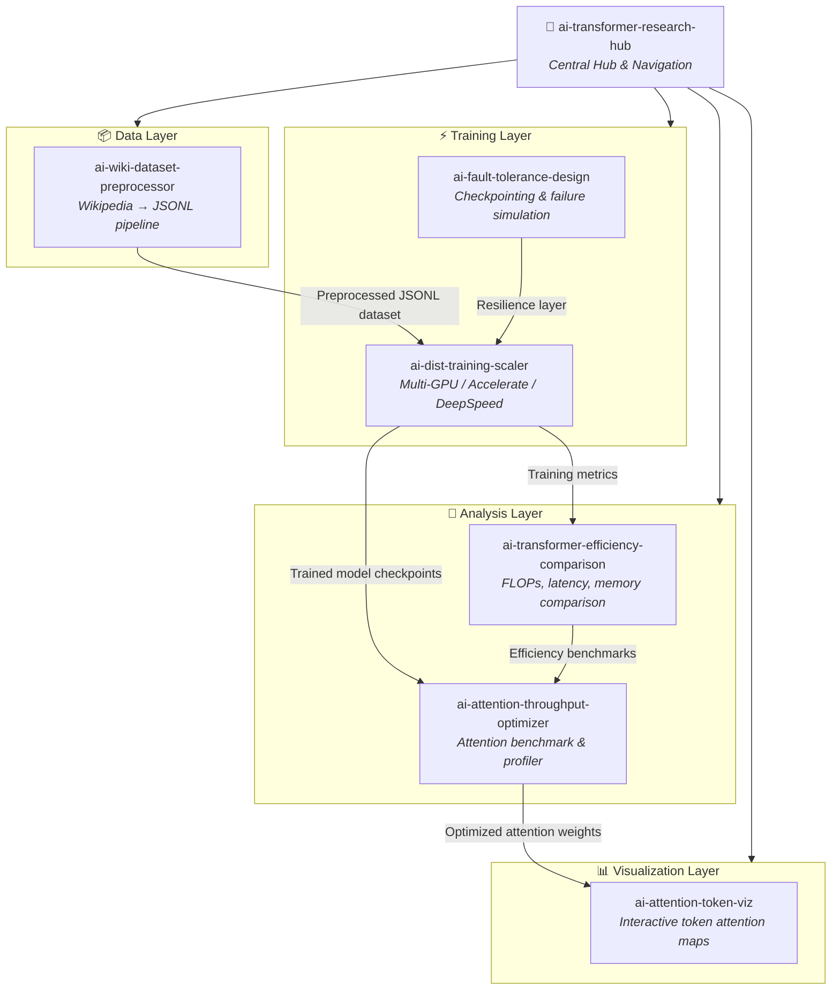

# Architecture Overview

This document describes the high-level architecture of the Transformer Research Hub ecosystem and how the six sister projects interconnect.

## System Diagram



## Component Descriptions

### 🤖 ai-transformer-research-hub (this repo)
The central hub that provides navigation, documentation, and links to all six sister projects. Serves as the entry point for new researchers.

### 📦 Data Layer

#### ai-wiki-dataset-preprocessor
Processes raw Wikipedia XML dumps into clean, model-ready JSONL or plain-text format. Handles tokenization, filtering, deduplication, and sharding. Feeds downstream training pipelines.

**Outputs:** `*.jsonl` shards, vocabulary files, dataset statistics

### ⚡ Training Layer

#### ai-dist-training-scaler
Orchestrates multi-GPU and multi-node distributed Transformer training using HuggingFace Accelerate and Microsoft DeepSpeed. Supports ZeRO stages 1–3, mixed precision, and gradient checkpointing.

**Inputs:** preprocessed datasets from `ai-wiki-dataset-preprocessor`  
**Outputs:** model checkpoints, training logs, TensorBoard metrics

#### ai-fault-tolerance-design
Provides fault tolerance infrastructure: periodic checkpointing, automatic resume on failure, and a Monte Carlo simulator for estimating job survival probability at scale.

**Integrates with:** `ai-dist-training-scaler` as a resilience wrapper

### 🔬 Analysis Layer

#### ai-attention-throughput-optimizer
Profiles and benchmarks attention mechanism implementations (vanilla softmax, Flash Attention, linear attention, sparse variants). Reports throughput, memory footprint, and latency across sequence lengths.

**Inputs:** model checkpoints from `ai-dist-training-scaler`  
**Outputs:** benchmark CSVs, profiling reports, optimized attention modules

#### ai-transformer-efficiency-comparison
Systematically compares Transformer variants by FLOPs, wall-clock latency, and peak GPU memory. Produces publication-ready tables and plots.

**Inputs:** trained models or randomly initialized weights of comparable size  
**Outputs:** comparison tables, matplotlib/plotly figures, Markdown reports

### 📊 Visualization Layer

#### ai-attention-token-viz
Interactive web UI (Streamlit / Plotly) that renders token-to-token attention heatmaps for any HuggingFace-compatible language model. Supports head-level and layer-level navigation.

**Inputs:** attention weight tensors from any Transformer model  
**Outputs:** interactive HTML visualizations, PNG exports

---

## Data Flow Summary

```
Wikipedia dump (.xml.bz2)
        │
        ▼
ai-wiki-dataset-preprocessor
        │  JSONL shards
        ▼
ai-dist-training-scaler ◄──── ai-fault-tolerance-design
        │  checkpoints + metrics
        ├──────────────────────────────────────────┐
        ▼                                          ▼
ai-attention-throughput-optimizer    ai-transformer-efficiency-comparison
        │  optimized weights                       │  benchmark reports
        ▼                                          │
ai-attention-token-viz ◄───────────────────────────┘
        │  interactive visualizations
        ▼
   Researcher / Publication
```

## Technology Stack

| Layer | Technologies |
|-------|-------------|
| Data | Python, WikiExtractor, HuggingFace Datasets, Apache Arrow |
| Training | PyTorch, HuggingFace Accelerate, DeepSpeed, NCCL |
| Fault Tolerance | Python, custom checkpointing, Monte Carlo simulation |
| Analysis | PyTorch Profiler, Flash Attention, Triton, NumPy, Pandas |
| Visualization | Streamlit, Plotly, Matplotlib, BertViz |
| CI/CD | GitHub Actions, pytest, flake8 |
| Infra | Docker, Kubernetes, Slurm |
