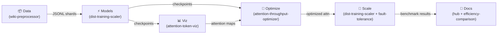

# Strategic Development Roadmap

Kanban-style roadmap tracking the end-to-end progress of the Transformer Research Hub ecosystem.

## Pipeline Overview

---

## Kanban Board

### 🗂️ Backlog

| ID | Task | Repo | Phase |
|----|------|------|-------|
| B-06 | LLaMA-3 / GPT-4 / RWKV benchmark comparison table | ai-transformer-efficiency-comparison | 5 |
| B-07 | PapersWithCode leaderboard integration | ai-transformer-research-hub | 5 |
| B-08 | Streamlit Cloud / HuggingFace Spaces deployment | ai-attention-token-viz | 5 |
| B-09 | Kubernetes manifests for multi-GPU training jobs | ai-dist-training-scaler | 5 |
| B-10 | SOTA alignment report (vs LLaMA-3-8B, Mistral-7B) | ai-transformer-efficiency-comparison | 5 |

---

### In Progress

_No items currently in progress._

---

### ✅ Done

| ID | Task | Repo | Completed |
|----|------|------|-----------|
| D-01 | Core dataset preprocessing pipeline | ai-wiki-dataset-preprocessor | Phase 1 |
| D-02 | Attention mechanism benchmarking framework | ai-attention-throughput-optimizer | Phase 1 |
| D-03 | Transformer efficiency comparison suite | ai-transformer-efficiency-comparison | Phase 1 |
| D-04 | Distributed training infrastructure | ai-dist-training-scaler | Phase 1 |
| D-05 | Fault tolerance design & simulation | ai-fault-tolerance-design | Phase 1 |
| D-06 | Attention visualization tooling | ai-attention-token-viz | Phase 1 |
| D-07 | Hub README with project ecosystem table | ai-transformer-research-hub | Phase 1 |
| D-08 | Architecture Mermaid diagram | ai-transformer-research-hub | Phase 1 |
| D-09 | Hub enhancements (badges, diagrams, roadmap) | ai-transformer-research-hub | Phase 1A |
| D-10 | GitHub Pages deploy workflow | ai-transformer-research-hub | Phase 1A |
| D-11 | Weekly stats cron job (`.github/workflows/weekly-stats.yml`) | ai-transformer-research-hub | Phase 1A |
| D-12 | Notebook stubs + script framework | ai-transformer-research-hub | Phase 1A |
| D-13 | Multi-root VS Code workspace | ai-transformer-research-hub | Phase 4 |
| D-14 | End-to-end pipeline script (`scripts/run-e2e-pipeline.sh`) | ai-transformer-research-hub | Phase 4 |
| D-15 | YouTube demo template notebooks (`templates/youtube-demo-outline.md`) | ai-transformer-research-hub | Phase 4 |
| D-16 | Cross-repo artefact sync (`scripts/sync_repos.sh`) | ai-transformer-research-hub | Phase 4 |
| D-17 | Streamlit demo configs (`.streamlit/config.toml`) | ai-transformer-research-hub | Phase 4 |
| D-18 | Docker + Compose deployment (`Dockerfile`, `docker-compose.yml`) | ai-transformer-research-hub | Phase 4 |
| D-19 | Notebook 01 — Wikipedia dump → JSONL pipeline | ai-transformer-research-hub | Phase 3 |
| D-20 | Notebook 02 — FlashAttention-2/3 benchmark | ai-transformer-research-hub | Phase 3 |
| D-21 | Notebook 03 — GPT-2 vs RWKV Pareto analysis | ai-transformer-research-hub | Phase 3 |
| D-22 | Notebook 04 — Attention viz + Streamlit app | ai-transformer-research-hub | Phase 3 |
| D-23 | Notebook 05 — DeepSpeed ZeRO-3 training loop | ai-transformer-research-hub | Phase 3 |
| D-24 | Notebook 06 — Chaos engineering simulator | ai-transformer-research-hub | Phase 3 |
| D-25 | Per-repo Copilot instructions (`docs/instructions/`) | ai-transformer-research-hub | Phase 2 |

---

## Phase Details

### Phase 1 — Hub Enhancements ✅

- Dynamic shields.io badges (stars, forks, last-updated) in README ecosystem table
- "Clone All" bash script (`scripts/clone-all.sh`)
- Mermaid pipeline diagram in README and `docs/roadmap.md`
- GitHub Actions cron job for weekly badge/stats refresh
- GitHub Pages deploy from README
- `docs/roadmap.md` Kanban board (this document)

### Phase 2 — Repo Hardening ✅ (Instructions Complete)

Sequence: wiki → attn-optimizer → efficiency-comparison → token-viz → dist-scaler → fault-tolerance

For each repo:

- `.github/copilot-instructions.md` with PyTorch 2.3+, IBM WatsonX compat, GPU-first, wandb logging,
  arXiv citations — stored in [`docs/instructions/<repo>/copilot-instructions.md`](../docs/instructions/)
- pytest suite + CI workflow update (template: `templates/repo-ci.yml`)
- Cross-link datasets/models (e.g., wiki JSONL → trainers)

### Phase 3 — Notebook Pipelines ✅ (Complete)

| Notebook | Repo | Deliverable | Status |
|----------|------|-------------|--------|
| 01_wiki_preprocessing.ipynb | ai-wiki-dataset-preprocessor | Full dump → JSONL pipeline; MinHash dedup; HuggingFace export | ✅ Complete |
| 02_flashattn3_benchmark.ipynb | ai-attention-throughput-optimizer | FlashAttention-2/3 benchmark (1k–64k seq lengths); Plotly heatmaps | ✅ Complete |
| 03_gpt2_rwkv_pareto.ipynb | ai-transformer-efficiency-comparison | GPT-2 vs RWKV perplexity × latency Pareto analysis | ✅ Complete |
| 04_attention_viz_streamlit.ipynb | ai-attention-token-viz | BERT attention extractor + Streamlit heatmap app generator | ✅ Complete |
| 05_deepspeed_zero3_training.ipynb | ai-dist-training-scaler | ZeRO-3 training loop with fault injection + checkpoint recovery | ✅ Complete |
| 06_chaos_fault_injection.ipynb | ai-fault-tolerance-design | DistributedTrainingSimulator + Monte Carlo reliability curve | ✅ Complete |

### Phase 4 — Integration ✅ (Framework Complete)

- [x] Multi-root VS Code workspace configuration (`transformer-research-hub.code-workspace`)
- [x] End-to-end pipeline demonstration: wiki → train → viz → optimize → scale (`scripts/run-e2e-pipeline.sh`)
- [x] Cross-repo artefact sync (`scripts/sync_repos.sh`)
- [x] YouTube demo template notebooks published in the hub (`templates/youtube-demo-outline.md`)
- [x] Streamlit demo configs (`.streamlit/config.toml`)
- [x] Docker + Compose deployment (`Dockerfile`, `docker-compose.yml`)

### Phase 5 — AI Industry Benchmarking (Planned)

Align the ecosystem with state-of-the-art models and public leaderboards.

| Task | Repo | Description |
|------|------|-------------|
| SOTA comparison table | ai-transformer-efficiency-comparison | Compare trained models vs LLaMA-3-8B, Mistral-7B, GPT-2-XL |
| PapersWithCode integration | ai-transformer-research-hub | Automated leaderboard fetch + README badge |
| HuggingFace Spaces deployment | ai-attention-token-viz | Live attention viz demo hosted on HF Spaces |
| Kubernetes manifests | ai-dist-training-scaler | Helm chart for multi-GPU training jobs on K8s |
| RWKV vs Transformer at scale | ai-transformer-efficiency-comparison | Chinchilla-optimal comparison at 1B+ params |
| Long-context benchmark | ai-attention-throughput-optimizer | LongBench evaluation at 32k–128k context |

---

## Milestones

| Milestone | Target Date | Status |
|-----------|-------------|--------|
| Phase 1 complete | 2026-03-29 | ✅ Complete |
| Phase 4 framework complete | 2026-03-29 | ✅ Complete |
| Phase 3 complete | 2026-03-29 | ✅ Complete |
| Phase 2 instructions complete | 2026-03-29 | ✅ Complete |
| Phase 2 full hardening (pytest + CI per repo) | 2026-05-15 | ⏳ Planned |
| Phase 4 full integration | 2026-07-31 | ⏳ Planned |
| Phase 5 complete | 2026-09-30 | ⏳ Planned |
