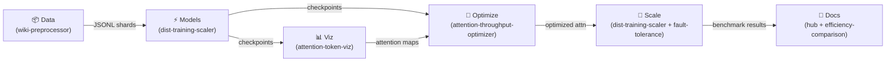

# Strategic Development Roadmap

Kanban-style roadmap tracking the end-to-end progress of the Transformer Research Hub ecosystem.

## Pipeline Overview

---

## Kanban Board

### 🗂️ Backlog

| ID | Task | Repo | Phase |
|----|------|------|-------|
| B-01 | FlashAttention-3 benchmark (1k–64k seq) | ai-attention-throughput-optimizer | 3 |
| B-02 | GPT-2 vs RWKV on wiki data + Pareto plots | ai-transformer-efficiency-comparison | 3 |
| B-03 | Streamlit attention heatmap app + HF integration | ai-attention-token-viz | 3 |
| B-04 | DeepSpeed ZeRO-3 train on wiki data | ai-dist-training-scaler | 3 |
| B-05 | Chaos/fault-injection tests for scaler | ai-fault-tolerance-design | 3 |
| B-06 | Multi-root VS Code workspace | ai-transformer-research-hub | 4 |
| B-07 | End-to-end pipeline: wiki → train → viz → optimize → scale | all | 4 |
| B-08 | YouTube demo template notebooks | ai-transformer-research-hub | 4 |
| B-09 | LLaMA-3 / GPT-4 / RWKV benchmark comparison table | ai-transformer-efficiency-comparison | 5 |
| B-10 | PapersWithCode leaderboard integration | ai-transformer-research-hub | 5 |
| B-11 | Streamlit Cloud / HuggingFace Spaces deployment | ai-attention-token-viz | 5 |
| B-12 | Kubernetes manifests for multi-GPU training jobs | ai-dist-training-scaler | 5 |
| B-13 | SOTA alignment report (vs LLaMA-3-8B, Mistral-7B) | ai-transformer-efficiency-comparison | 5 |

---

### In Progress

| ID | Task | Repo | Owner | Started |
|----|------|------|-------|---------|
| P-01 | Hub enhancements (badges, diagrams, roadmap) | ai-transformer-research-hub | @TylrDn | 2026-03-29 |
| P-02 | GitHub Pages deploy workflow | ai-transformer-research-hub | @TylrDn | 2026-03-29 |
| P-03 | Weekly stats cron job | ai-transformer-research-hub | @TylrDn | 2026-03-29 |
| P-04 | Notebook stubs + script framework (Phase 3/4) | ai-transformer-research-hub | @TylrDn | 2026-03-29 |

---

### ✅ Done

| ID | Task | Repo | Completed |
|----|------|------|-----------|
| D-01 | Core dataset preprocessing pipeline | ai-wiki-dataset-preprocessor | Phase 1 |
| D-02 | Attention mechanism benchmarking framework | ai-attention-throughput-optimizer | Phase 1 |
| D-03 | Transformer efficiency comparison suite | ai-transformer-efficiency-comparison | Phase 1 |
| D-04 | Distributed training infrastructure | ai-dist-training-scaler | Phase 1 |
| D-05 | Fault tolerance design & simulation | ai-fault-tolerance-design | Phase 1 |
| D-06 | Attention visualization tooling | ai-attention-token-viz | Phase 1 |
| D-07 | Hub README with project ecosystem table | ai-transformer-research-hub | Phase 1 |
| D-08 | Architecture Mermaid diagram | ai-transformer-research-hub | Phase 1 |

---

## Phase Details

### Phase 1 — Hub Enhancements ✅ / 🔄

- Dynamic shields.io badges (stars, forks, last-updated) in README ecosystem table
- "Clone All" bash script (`scripts/clone-all.sh`)
- Mermaid pipeline diagram in README and `docs/roadmap.md`
- GitHub Actions cron job for weekly badge/stats refresh
- GitHub Pages deploy from README
- `docs/roadmap.md` Kanban board (this document)

### Phase 2 — Repo Hardening (Planned)

Sequence: wiki → attn-optimizer → efficiency-comparison → token-viz → dist-scaler → fault-tolerance

For each repo:

- `.github/copilot-instructions.md` with PyTorch 2.3+, IBM WatsonX compat, GPU-first, wandb logging, arXiv citations
- pytest suite + CI workflow update
- Cross-link datasets/models (e.g., wiki JSONL → trainers)

### Phase 3 — Notebook Pipelines (Planned)

| Repo | Deliverable |
|------|-------------|
| ai-wiki-dataset-preprocessor | Full dump → JSONL pipeline notebook; HuggingFace Dataset export |
| ai-attention-throughput-optimizer | FlashAttention-3 benchmark notebook (1k–64k seq lengths) |
| ai-transformer-efficiency-comparison | GPT-2 vs RWKV on wiki data; Pareto efficiency plots |
| ai-attention-token-viz | Streamlit attention heatmap app with HuggingFace integration |
| ai-dist-training-scaler | DeepSpeed ZeRO-3 training on wiki data with fault injection |
| ai-fault-tolerance-design | Chaos engineering tests for the distributed scaler |

### Phase 4 — Integration (Planned)

- Multi-root VS Code workspace configuration (`transformer-research-hub.code-workspace`)
- End-to-end pipeline demonstration: wiki → train → viz → optimize → scale (`scripts/run-e2e-pipeline.sh`)
- Cross-repo artefact sync (`scripts/sync_repos.sh`)
- YouTube demo template notebooks published in the hub (`templates/youtube-demo-outline.md`)
- Streamlit demo configs (`.streamlit/config.toml`)
- Docker + Compose deployment (`Dockerfile`, `docker-compose.yml`)

### Phase 5 — AI Industry Benchmarking (Planned)

Align the ecosystem with state-of-the-art models and public leaderboards.

| Task | Repo | Description |
|------|------|-------------|
| SOTA comparison table | ai-transformer-efficiency-comparison | Compare trained models vs LLaMA-3-8B, Mistral-7B, GPT-2-XL |
| PapersWithCode integration | ai-transformer-research-hub | Automated leaderboard fetch + README badge |
| HuggingFace Spaces deployment | ai-attention-token-viz | Live attention viz demo hosted on HF Spaces |
| Kubernetes manifests | ai-dist-training-scaler | Helm chart for multi-GPU training jobs on K8s |
| RWKV vs Transformer at scale | ai-transformer-efficiency-comparison | Chinchilla-optimal comparison at 1B+ params |
| Long-context benchmark | ai-attention-throughput-optimizer | LongBench evaluation at 32k–128k context |

---

## Milestones

| Milestone | Target Date | Status |
|-----------|-------------|--------|
| Phase 1 complete | 2026-04-15 | 🔄 In Progress |
| Phase 2 complete | 2026-05-15 | ⏳ Planned |
| Phase 3 complete | 2026-06-30 | ⏳ Planned |
| Phase 4 complete | 2026-07-31 | ⏳ Planned |
| Phase 5 complete | 2026-09-30 | ⏳ Planned |
