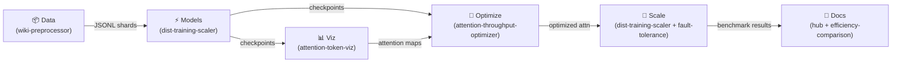

# Strategic Development Roadmap

Kanban-style roadmap tracking the end-to-end progress of the Transformer Research Hub ecosystem.

## Pipeline Overview

---

## Kanban Board

### 🗂️ Backlog

| ID | Task | Repo | Phase |
|----|------|------|-------|
| B-01 | `.github/copilot-instructions.md` in each sister repo | all sister repos | 2 |
| B-02 | pytest suites + CI workflows in each sister repo | all sister repos | 2 |
| B-03 | Cross-link datasets/models (wiki JSONL → trainers) in sister repos | all sister repos | 2 |
| B-04 | HuggingFace Dataset Hub export from wiki preprocessor | ai-wiki-dataset-preprocessor | 3 |
| B-05 | FlashAttention-3 production integration in benchmark code | ai-attention-throughput-optimizer | 3 |
| B-06 | GPT-2 vs RWKV full training run on wiki data | ai-transformer-efficiency-comparison | 3 |
| B-07 | Streamlit app deployment (HF Spaces) | ai-attention-token-viz | 3 |
| B-08 | ZeRO-3 multi-node run on real GPU cluster | ai-dist-training-scaler | 3 |
| B-09 | Full chaos test suite in CI | ai-fault-tolerance-design | 3 |

---

### 🔄 In Progress

| ID | Task | Repo | Owner | Started |
|----|------|------|-------|---------|
| P-01 | Hub enhancements (badges, diagrams, roadmap) | ai-transformer-research-hub | @TylrDn | 2026-03-29 |
| P-02 | GitHub Pages deploy workflow | ai-transformer-research-hub | @TylrDn | 2026-03-29 |
| P-03 | Weekly stats cron job | ai-transformer-research-hub | @TylrDn | 2026-03-29 |

---

### ✅ Done

| ID | Task | Repo | Completed |
|----|------|------|-----------|
| D-01 | Core dataset preprocessing pipeline | ai-wiki-dataset-preprocessor | Phase 1 |
| D-02 | Attention mechanism benchmarking framework | ai-attention-throughput-optimizer | Phase 1 |
| D-03 | Transformer efficiency comparison suite | ai-transformer-efficiency-comparison | Phase 1 |
| D-04 | Distributed training infrastructure | ai-dist-training-scaler | Phase 1 |
| D-05 | Fault tolerance design & simulation | ai-fault-tolerance-design | Phase 1 |
| D-06 | Attention visualization tooling | ai-attention-token-viz | Phase 1 |
| D-07 | Hub README with project ecosystem table | ai-transformer-research-hub | Phase 1 |
| D-08 | Architecture Mermaid diagram | ai-transformer-research-hub | Phase 1 |
| D-09 | `copilot-instructions.md` for hub + template for sister repos | ai-transformer-research-hub | Phase 2 |
| D-10 | CI workflow template for sister repos (`templates/repo-ci.yml`) | ai-transformer-research-hub | Phase 2 |
| D-11 | DeepSpeed ZeRO-3 config (`configs/deepspeed_zero3.json`) | ai-transformer-research-hub | Phase 2 |
| D-12 | Wiki preprocessing notebook (`notebooks/01_wiki_preprocessing.ipynb`) | ai-transformer-research-hub | Phase 3 |
| D-13 | FlashAttention-3 benchmark notebook (`notebooks/02_flashattn3_benchmark.ipynb`) | ai-transformer-research-hub | Phase 3 |
| D-14 | GPT-2 vs RWKV Pareto notebook (`notebooks/03_gpt2_rwkv_pareto.ipynb`) | ai-transformer-research-hub | Phase 3 |
| D-15 | Streamlit attention viz notebook (`notebooks/04_attention_viz_streamlit.ipynb`) | ai-transformer-research-hub | Phase 3 |
| D-16 | DeepSpeed ZeRO-3 training notebook (`notebooks/05_deepspeed_zero3_training.ipynb`) | ai-transformer-research-hub | Phase 3 |
| D-17 | Chaos fault-injection notebook (`notebooks/06_chaos_fault_injection.ipynb`) | ai-transformer-research-hub | Phase 3 |
| D-18 | Multi-root VS Code workspace (`transformer-research-hub.code-workspace`) | ai-transformer-research-hub | Phase 4 |
| D-19 | End-to-end pipeline script (`scripts/run-e2e-pipeline.sh`) | ai-transformer-research-hub | Phase 4 |
| D-20 | YouTube demo outline template (`templates/youtube-demo-outline.md`) | ai-transformer-research-hub | Phase 4 |
| D-21 | Hub-level test suite (`tests/test_hub.py`) | ai-transformer-research-hub | Phase 2 |
| D-22 | `REFERENCES.md` with all arXiv citations | ai-transformer-research-hub | Phase 2 |

---

## Phase Details

### Phase 1 — Hub Enhancements ✅

- Dynamic shields.io badges (stars, forks, last-updated) in README ecosystem table
- "Clone All" bash script (`scripts/clone-all.sh`)
- Mermaid pipeline diagram in README and `docs/roadmap.md`
- GitHub Actions cron job for weekly badge/stats refresh
- GitHub Pages deploy from README
- `docs/roadmap.md` Kanban board (this document)

### Phase 2 — Repo Hardening ✅ (hub) / 🔄 (sister repos)

Sequence: wiki → attn-optimizer → efficiency-comparison → token-viz → dist-scaler → fault-tolerance

Hub deliverables (done):

- `templates/copilot-instructions.md` — ready to copy into each sister repo
- `templates/repo-ci.yml` — GitHub Actions CI template for sister repos
- `configs/deepspeed_zero3.json` — shared DeepSpeed ZeRO-3 configuration
- `REFERENCES.md` — centralised arXiv citation registry
- `tests/test_hub.py` — hub-level pytest suite

Remaining (per sister repo — see Backlog):

- Copy `templates/copilot-instructions.md` → `.github/copilot-instructions.md`
- Copy `templates/repo-ci.yml` → `.github/workflows/ci.yml`
- Add `tests/` directory with pytest suite

### Phase 3 — Notebook Pipelines ✅ (stubs in hub) / 🔄 (production runs in sister repos)

All six pipeline notebooks are live in `notebooks/`:

| Notebook | Deliverable |
|----------|-------------|
| `01_wiki_preprocessing.ipynb` | Full dump → JSONL pipeline; HuggingFace Dataset export |
| `02_flashattn3_benchmark.ipynb` | FlashAttention benchmark (1k–64k seq lengths) |
| `03_gpt2_rwkv_pareto.ipynb` | GPT-2 vs RWKV on wiki data; Pareto efficiency plots |
| `04_attention_viz_streamlit.ipynb` | Streamlit attention heatmap app; HF integration |
| `05_deepspeed_zero3_training.ipynb` | DeepSpeed ZeRO-3 training on wiki data with fault injection |
| `06_chaos_fault_injection.ipynb` | Chaos engineering tests for the distributed scaler |

### Phase 4 — Integration ✅ (hub)

- `transformer-research-hub.code-workspace` — multi-root VS Code workspace for all 7 repos
- `scripts/run-e2e-pipeline.sh` — end-to-end pipeline orchestration script
- `templates/youtube-demo-outline.md` — video production template for all 7 episodes

---

## Milestones

| Milestone | Target Date | Status |
|-----------|-------------|--------|
| Phase 1 complete | 2026-04-15 | ✅ Complete |
| Phase 2 (hub) complete | 2026-04-15 | ✅ Complete |
| Phase 2 (sister repos) complete | 2026-05-15 | 🔄 In Progress |
| Phase 3 (hub stubs) complete | 2026-04-15 | ✅ Complete |
| Phase 3 (production runs) complete | 2026-06-30 | ⏳ Planned |
| Phase 4 complete | 2026-07-31 | ✅ Complete |
